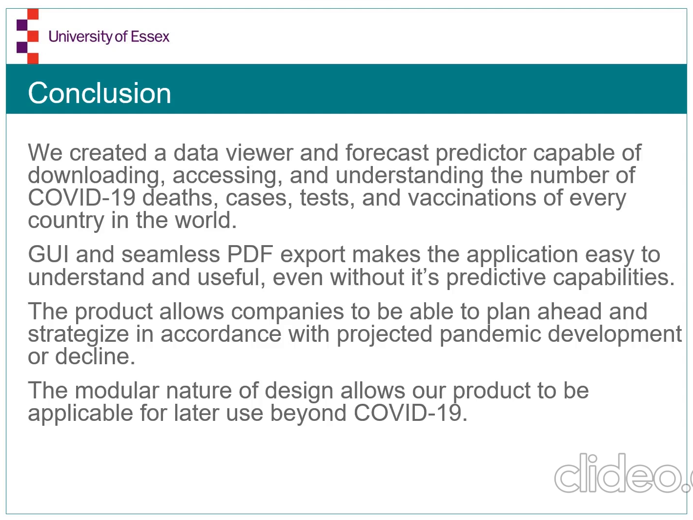

# Covid-19 Analysis
## Group project 2nd year at University of Essex
Worked with a team of 8 to develop a Covid-19 modelling and forecast tool that predicts infections, deaths, tests, and vaccinations for every country in the world. Developed also, an interactive world-map GUI.
Repository includes the presentation video.

